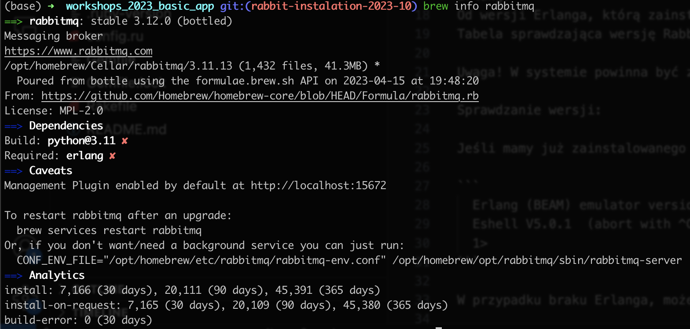
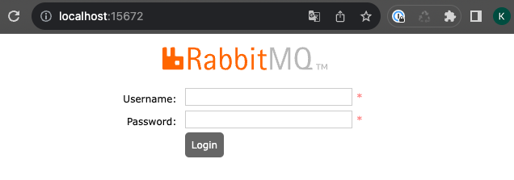

# Instalcja RabbitMQ

## MacOS

1. Instalujemy RabbitMQ: `brew install rabbitmq`. Po poprawnej instalacji komenda `brew info rabbitmq`, powinna nam zwrócić informacje na temat wersji Rabbita, używanego portu itp.




2. Aby uruchomić system kolejkowy wpisujemy `brew services start rabbitmq`, to pozwoli nam uruchomić rabbita lokalnie w tle.
3. Jeśli wszystko pójdzie ok, to pod adresem `http://localhost:15672` powinniśmy zobaczyć panel, do którego logujemy się jako gość, gość ;) (guest/guest).



## Windows

1. Do instalacji i uruchomienia RabbitMQ, będziemy w pierwszej kolejności potrzebowali mieć zainstalowany Erlang.
Od wersji Erlanga, którą zainstalujecie będzie zależało jaką wersje RabitMQ będzie można zainstalować. 
Tabela sprawdzająca wersję Rabbita i Erlanga https://www.rabbitmq.com/which-erlang.html .

Uwaga! W systemie powinna być zainstalowana tylko jedna wersja Erlanga.

Sprawdzanie wersji:

Jeśli mamy już zainstalowanego Erlanga to uruchamiamy go dwuklikiem, powinno otworzyć się okno z info np:

```
  Erlang (BEAM) emulator version 5.0.1 [threads]
  Eshell V5.0.1  (abort with ^G)
  1>
```
(można też wpisać w terminalu komendę erl lub werl)

W przypadku braku Erlanga, możemy go pobrać z linku:

Zainstalujmy wersję 25.3.2 -> https://github.com/erlang/otp/releases/download/OTP-25.3.2/otp_win64_25.3.2.exe
ze strony https://erlang.org/download/otp_versions_tree.html .

!! Po instalacji należy zrestartować komputer.


2. Jeśli mamy ju zainstalowanego Erlanga, mozemy pobrac i zainstalować serwer RabbitMQ https://github.com/rabbitmq/rabbitmq-server/releases/download/v3.11.15/rabbitmq-server-3.11.15.exe
3. Włączanie Pluginu do zarządzanie RabbitMQ: (https://docs.servicestack.net/install-rabbitmq-windows#enable-rabbit-mq-s-management-plugin)

W konsoli wpisujemy: 
`"C:\Program Files (x86)\RabbitMQ Server\rabbitmq_server-3.11.15\sbin\rabbitmq-plugins.bat" enable rabbitmq_management`

Uwaga! Ścieżka może byc różna w Waszym systemie np. bez (x86).

Restartujemy serwer w konsoli: `net stop RabbitMQ && net start RabbitMQ` UWAGA! Konsola musi w trybie administratora!

Serwer możemy też uruchomić wyszukując polecenie `RabbitMQ Command Prompt`.

4. Jeśli wszystko pójdzie ok, to pod adresem `http://localhost:15672` powinniśmy zobaczyć panel, do którego logujemy się jako gość, gość ;) (guest/guest).


## Ubuntu/Debian

1. https://computingforgeeks.com/how-to-install-latest-rabbitmq-server-on-ubuntu-linux/ -> najpierw instalacje erlanga a później rabbita.

2. Jeśli wszystko pójdzie ok, to pod adresem `http://localhost:15672` powinniśmy zobaczyć panel, do którego logujemy się jako gość, gość ;) (guest/guest).
