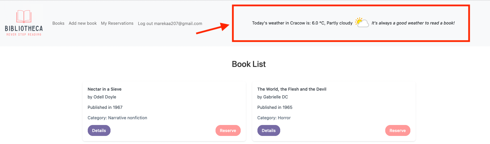

# Integracja aplikacji z API pogodowym

## Cel zadania

Chcemy połączyć naszą aplikację w Ruby on Rails z API pogodowym dostarczanym przez https://www.weatherapi.com, aby:
- wyświetlić bieżące dane pogodowe w aplikacji,
- wyświetlić odpowiedni tekst uzależniony od pogody.

## Dwa etapy zadania

1. Założymy konto w serwisie dostarczającym API z danymi o pogodzie i uzyskamy klucz API.
2. Dokonamy zmiany w aplikacji, aby odpowiednio pozyskać dane i wyświetlić je w aplikacji.

## Działamy!

## Etap 1 - pozyskanie klucza API

1. Wchodzimy na stronę https://www.weatherapi.com/signup.aspx i zakładamy darmowe konto.
2. Potwierdzamy konto (na maila przyjdzie link, w który należy kliknąć).
3. Tu mamy informacje dot. korzystania z API i przydatne linki, np. do dokumentacji API https://www.weatherapi.com/my/ oraz mamy podany wygenerowany automatycznie klucz API, kopiujemy sobie gdzieś ten klucz, bedziemy z niego później korzystać.
4. Tu mamy kilka przydatnych linków, aby zapoznać się z tym jak działa API: 
 - api explorer: https://www.weatherapi.com/api-explorer.aspx
 - dokumentacja: https://www.weatherapi.com/docs/
5. Korzystamy dla rozeznania z API explorer, podajemy swój klucz API, pozostawiamy pozostałe opcje (http i json) i klikamy “Show response” dla bieżącej pogody (zakładką “current”), bo z takiej bedziemy korzystać.
6. Możemy też wpisać w przeglądarkę bezpośrednio nasz przykładowy request (z wstawionym naszym kluczem API) i zobaczyć jakie dane otrzymujemy, natomiast nie będziemy ze wszystkich korzystać, wyciągniemy tylko te, których chcemy uzyć.

## Etap 2 - wdrożenie danych pogodowych w aplikacji

1. Wychodzimy z najnowszego brancha głównego `main` i tworzymy swój branch na zmiany, np. `weather_api`.
2. Chcemy skorzystać z nastepujących informacji (te dane musimy wyłuskać z odpowiedzi na nasz request):
 - temperatura
 - tekstowy opis
 - ikonka pokazująca graficzną reprezentację opisu
3. Najpierw zapiszmy nasz klucz API w bezpiecznym miejscu, do którego będziemy się odnosić w kodzie. Wykorzystamy do tego gem 'A9n':
 - dodajemy gem do Gemfile; gem 'a9n' i uruchamiamy `bundle`
 - w pliku `config/application.rb` dodajemy odpowiedni zapis w kontekscie A9n
    ```
    A9n.root = File.expand_path('..', __dir__)
    A9n.load
    ```
 - w katalogu `config` tworzymy plik `configuration.yml.example`, w którym dodajemy nasz klucz, ale... aby nie był on publicznie dostępny wskazujemy tu jedynie, że to jest miejsce na ten klucz
    ```
    defaults:
      weather_api_key: '__your_api_key__'
    ```
 - nasz właściwy klucz dodajemy w pliku `config/configuration.yml`, który wykluczamy ze śledzonych zmian poprzez dodanie zapisu w .gitignore
    ```
    # Ignore personal configuration
    /config/configuration.yml
    ```

4. Tworzymy serwis, który bedzie nam pobierał komplet bieżących danych pogodowych `app/services/weather_api_connector.rb`.
5. Tu przykładowy artykuł listujący metody tworzenia requestów do API https://www.twilio.com/blog/5-ways-make-http-requests-ruby, skorzystamy z tej pierwszej, dlatego nalezy pamiętać o dodaniu w serwisie tworzącym klienta api zapisu `require 'net/http'`.
6. Wartości przekazujące klucz API oraz lokalizację zapisujemy do stałych, jeśli chodzi o lokalizację to dla uproszczenia przyjmujemy, że pobieramy dane dla Krakowa:
```
API_KEY = A9n.weather_api_key
LOCATION = 'Cracow'
```

7. Tworzymy metodę, która wykona request na odpowiedni adres z parametrami i w odpowiedzi zwróci nam dane pogodowe:

```
def weather_data
  url = "http://api.weatherapi.com/v1/current.json?key=#{API_KEY}&q=#{LOCATION}"
  uri = URI(url)
  response = Net::HTTP.get(uri)
  JSON.parse(response)
end
```
Jak sprawdzić czy do tego miejsca działamy prawidłowo?
Spróbuj w konsoli wywołać metodę `weather_data` z naszego serwisu, czyli `WeatherApiConnector.new.weather_data`, powinna nam ona zwrócić komplet danych z api pogodowego. 
Przy okazji pomoże nam to przygotować się do "wyłuskania" potrzebnych danych w kolejnym kroku.

8. Aby ładnie zaprezentować nasze dane pogodowe i tylko te, które sobie zaplanowaliśmy korzystamy z nowej warstwy abstrakcji i tworzymy presenter `app/presenters/weather_presenter.rb`.
9. W presenterze, bazując na danych z serwisu zwracającego odpowiedź z API pogodowego, tworzymy metody:
 - initializer przyjmujący zmienną `data`, czyli nasze dane z odpowiedzi punktu api
 - wyciągające określone dane z całego zestawu: `description`, `temperature`, `icon`
 - w dokumentacji możemy znaleźć zestaw wszystkich możliwych danych opisowych, jakie możemy otrzymać w zwrotce, po ich przejrzeniu można ustalić, ze ładna pogoda jest gdy:
```
def nice_weather?
  description == 'Sunny' || description == 'Partly cloudy'
end
```
  - biorąc pod uwagę część opisową jak i wartość liczbową dla stopni temperatury możemy się umówić, ze ładna pogoda jest, gdy jest słonecznie lub częściowo zachmurzone niebo oraz temperaturajest wyższa niz 15 stopni:
```
def good_to_read_outside?
  nice_weather? && temperature > 15
end
```
- bazując na wyniku powyższej metody możemy zaproponowac teksty, które będziemy wyświetlać w aplikacji obok danych pogodowych dla naszej lokalizacji:
```
def encourage_text
  if good_to_read_outside?
    "Get some snacks and go read a book in a park!"
  else
    "It's always a good weather to read a book!"
  end
end
```

Jak sprawdzić czy dobrze działa nasz presenter?
W konsoli zapisz sobie pod zmienną dane z odpowdzi api pogodowego `data = WeatherApiConnector.new.weather_data` oraz wywołanie presentera, np. `presenter = WeatherPresenter.new`, a następnie sprawdź co zwracają poszczególne metody presentera, np. `presenter.encourage_text`. 
Jeśli jest ok, możemy przejśc dalej, jeśli coś jeszcze nie działa jak należy poprawiamy.

10. Aby metody z naszego presentera były dostępne w całej aplikacji dodajemy odpowiednie metody w `app/helpers/application_helper.rb`, dzięki temu będą one dostępne globalnie:
```
  def weather_data
    @weather_data ||= WeatherApiConnector.new.weather_data
  end

  def weather_presenter
    @weather_presenter ||= WeatherPresenter.new(weather_data)
  end
```

11. Tworzymy plik widoku, partial `app/views/weather/_show.html.erb`, w którym możemy bazować na metodach z naszego presentera, aby zdynamizować wyświetlane treści. Ponieważ dostęp do presentera zapięliśmy tak "wysoko" jak się da, odwołanie do jego metod na widoku bedzie odbywać się w taki sposób `<%= weather_presenter.description %>`.
12. Plik ten musimy wywołać w głównym layoucie aplikacji, z racji, że chcemy, aby element ten wyświetlał się na każdej ze stron, dodajemy więc do `app/views/layouts/application.html.erb` dodatkowy div, w którym bedziemy renderować nasz widok pogody (dodajemy nasz div przed zamknięciem znacznika nav):
```
<div class="container">
  <%= render partial: "weather/show" %>
</div>
```
13. Dla dopracowania finalnego efektu wizualnego, ułożenia naszego elementu pogodowego możemy podziałać ze stylami bootstrapa, tutaj dokumentacja https://getbootstrap.com/docs/3.4/css/.
14. Jeśli jako efekt końcowy widzisz bieżące dane pogodowe wraz z tekstem zachęcającym do czytania to właśnie udało Ci się zakończyć pierwsze zadanie.
Całość powinna się prezentować tak:



# Zadania dodatkowe dla chętnych
1. Dopisz specki dla presentera.
